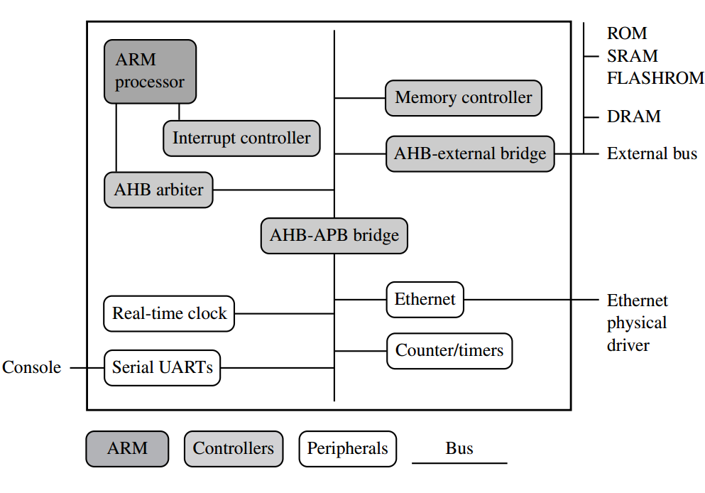

## The RISC Design Philosophy
- Aimed at delivering **simple** but **powerful** instruction set that
  execute within a **single cycle**.
- Reduces the complexity of the instructions and places great demands on the
  compiler. Therefore it relies more on software compared to CISC (Complex
  Instruction Set) that has more complex hardware
- The complexity is shifted to the software end rather than keeping in
  hardware, as it is easier to develop complexity in software.
- Less complexity in hardware = faster hardware\
  {width=50%}\
  **Four Rules of the philosophy**
    1. *Instructions*
       - Provide simple operations that can each execute in a **single cycle**.
       - The compiler needs to synthezide complex operatoiions, leaving it to
       the compiler to manage complexity rather than the hardware.
    2. *Pipelines*
       - Executing instructions in **parrallel** is done by piplining.
       - As the instrucitons are all **fixed length** (single cycle required),
       piplining can fetch the next instruction before the current is decoded
       - No need for an instruction to have microcode execution.
    3. *Registers*
       - RISC machines have a large general-purpose registers.
       - Any register can contain any data or an address. it's not fixed like
       CISC.
    4. *load-store architecture*
       - All data comes from registers **only**, therefore **Separate load
       and store instructions** do the job of transfering data between the
       registers and the memory.
       - The data on the register can accessed multiple times without
       requring multiple memory access.
       - CISC on the other hand have operations that access memory directly.

## ARM Design Philosophy
- ARM designed mainly for embedded applications, therefore there are many
constraints that have influenced it's design.
  1. **Low power consumption** -- usually embedded systems run on batteries/
  low power source
  2. **High code density** -- limited storage space in embedded devices due
  to high cost and limited space.
- It's not pure RISC due to its application restrictions -- embedded system.
  It uses a **modified RISC design** to make it better suited for embedded
  applications.
- **Non-RISC features of ARM**
  * *Variable cycle execution for certain instructions*
    - load-store-multiple instruction use multiple cycles. Depends on the no.
    of registers being trasfered.
    - **Code density is imporved** as multiple register transfers are common.
  * *Inline barrel shifter leading to more complex instructoins*
    - A component that pre-processes the registers before it's used
    - It **expands the capabilities of instructions and improves code density**
  * *Thumb 16-bit instruction set*
    - Permits to execute either 16 or 32 bit which **improves code density**
    - Eg. **Cheaper memory of 16bit** can be used with 16bit instruction which
    also **improves performance** as only a single fetch is requrired to load
    the instruction. 32bit requires two fetches.
  * *Conditional execution*
    - Reduces branch instructions, **improving performance & code density**
  * *Enhanced instructions*
    - DSP (Digital Signal Processor) added to ARM instruction to allow fast
    16 x 16-bit multiplier operations
    - Allow faster-performing ARM processor by replacing the combination of
    a processor plus a DSP.

## Embedded System Hardware
{width=60%}

- **ARM Processor** controls the embedded device, contains the core that
  executes instructions and interacts with other components.
- **Controllers** coordinates important functional blocks. Interrupt controller
and memory controllers
- **Peripherals** provide input/output capability
- **Busses** used to communicate with the different components.

**ARM Bus Technology**

- On a x86 PCs, the bus tech used is PCI that connects video cards, audio
  controller, etc, The PCI Bus is on the motherboard
- Embedded devices use an on-chip bus that is **internal to the chip** and
that allows different peripherals to be interconnected with an ARM core.
- Two types of device classes connected to the bus:
  - *Bus Master* -- A device that can initiate a data transfer. The ARM core is
the bus master
  - *Bus Slave* -- A device only capable of responding to transfer request

**AMBA Bus Protocol**

- **Advanced Microcontroller Bus Architecture** widely adopted for the on-chip
bus of the ARM processors
- ARM introduced ASB (ARM System Bus), APB (ARM Peripheral Bus) and later
ARM High Performance Bus
- There are many peripherals that use the AMBA interfaces so it makes easy
for hardware developers incorporates them in their designs.
- AHB provides higher data throughput compared to ASB because of it's
centralised multiplexed bus scheme, rather bidirectional design of ASB
- Multilayer AHB can have many bus masters. AHB-Lite can only have one bus
master. AHB-Lite is a subset of the standard AHB bus. Multilayer AHB good
for systems with multiple processor.

**Memory**

- *Hierarchy* 
    - `Cache -> Primary memory -> Secondary memory`
    - Cache provides overall increase in performance but with loss of
    predictable execution time, hence is no use in real-time systems.
    - A real-time system must be able to respond in time and for that it must
    know exactly how long operations will take.\
    {width=25%}
- *Types*
  - **ROM** - Mainly used to hold the boot code. There are Flash ROMs as well
  that allow writing as well but the write process is slow. Their main use
  is holding the **firmware** and some **long-term data**
  - **DRAM** - Dynamic RAM made of storage cells that have to constantly be 
  refreshed every few milliseconds.
  - **SRAM** - Static in the sense that it doesn't need to be dynamically 
  refreshed.  Faster than DRAM and also costlier.
  - **SDRAM** - Synchronous DRAM. Synchronizes with the processor clock.
  Internally data is fetched from memory cells and brought out in a burst.

**Peripherals**

- A peripheral device provides I/O to the chip by providing a connection to
external devices.
- The peripheral devices are on-chip and provide an interface to the external
devices. Eg. A USB peripheral device will provide the interface for the USB 
ports.
- ARM peripherals are *memory-mapped* and provide a programming interface.
- **Controllers** are specialized peripherals that implement higher level
functionality
  - **Memory Controllers**
    - They connect the different types of memories to the bus and provide
    sort of an interface.
    - On power-up they are configured to activate some memory device that
    help *initialization code* to execute.
  - **Interrupt Controllers**
    - 2 types -- *Standard* and *Vector Interrupt Controller*
    - *Standard* provides a signal to the core if an external device needs
    servicing. The interrupt handler determimes which device requries
    servicing depeding on the *device bitmap register* in the intterup
    controller
    - *VIC* is more powerful as it prioritizes interrupts and simplifies
    determination of which device caused interrupt. It assigns priority and
    handler address to each interrupt and signals the core only if the
    priority of the new interrupt is higher than the currently executing
    interrupt handler. It can either call the standard interrup handler that
    can load the address of the handler for the device or can directly cause
    the core to jump to the handler for the device.

## Embedded System Software
{width=35%}

- Initialization code is the first code executed which sets up the minimum
parts of the board before handing control over to the operating system.
- The OS provides the infrastructure for the applications to run and manages
system resources.
- Embedded devices usually don't require a full-blown OS, a mere task-scheduler
is sufficient most times
- The initialization code is usually stored in the ROM and is called the
**firmware**.
- Drivers provide standard interfaces to peripherals.

**Initialization (Boot) Code**

- Configures system resources, memory controller, processor caches and
initializes some devices on startup
- it handles administrative tasks in 3 phases:
  1. **Initial hardware configuration** 
    - Involves setting up the target platform (the hardware) so it can boot
    the OS image.
    - Configuring involves reorganizing the memory in order to meet the
    requirements/standards of the boot image.
    - Many Operating systems expect a known memory layout and hence it is important
    that the layout be setup during the initialization code. Figure 2 shows
    the memmory remapping process.\

    {width=40%}

  2. **Diagnostics**
    - Testing the system by exercising the hardware to check whether it's in
    working order.
    - It also tracks down problems and may give out diagnostic reports to 
    the programmer.
  3. **Booting**
    - Involves loading an image and handing control over to it.
    - Loading an Image means copying over an entire program including code and
    data into RAM. Once loaded the system (initializing code) hands over
    control by **modifying the program counter** to point to the start of the
    image. Decompression may also take place if the OS image is compressed.

**Operating System**

- The firmware code/Initialization code **prepares the hardware** for an
operating system to take control.
- An Operating System organizes the system resources: peripherals, memory,
and processing time (job scheduling).
- Operating system control the **resourses/infrastructure** so that they
can be efficiently used by the applications running on it.
- The Operating system provides a common environment to the applications
- **Real-Time Operating Systems (RTOSs)**
  - They provide guaranteed response times of events.
  - Systems running RTOs tend to lack a secondary storage.
  - Real-Time applications require RTOs
- **Platform Operating System**
  - They have a Memory Management Unit to run large, non-realtime applications
   and have a secondary storage.
- But there can be OS with characteristics of both.
- ARM has developed cores that target each category of OS/Application.

**Applications**

- The OS provides platform resources for applications to run. Many application
can run simultaneously.
- **Networking** -- Home gateways, DSL Modems, 802.11 wireless communication
- **Mobile phones are the largest application area for ARM**
- **Mass storage** - hard drives, **Imaging** - Ink Jet printers
- ARM was not designed to work in applications that require leading-edge high
performance.
