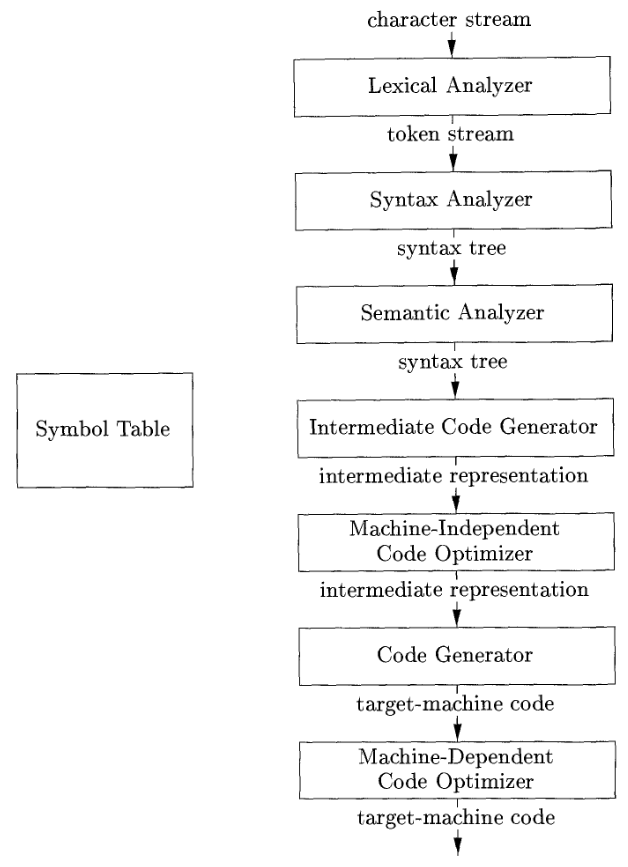
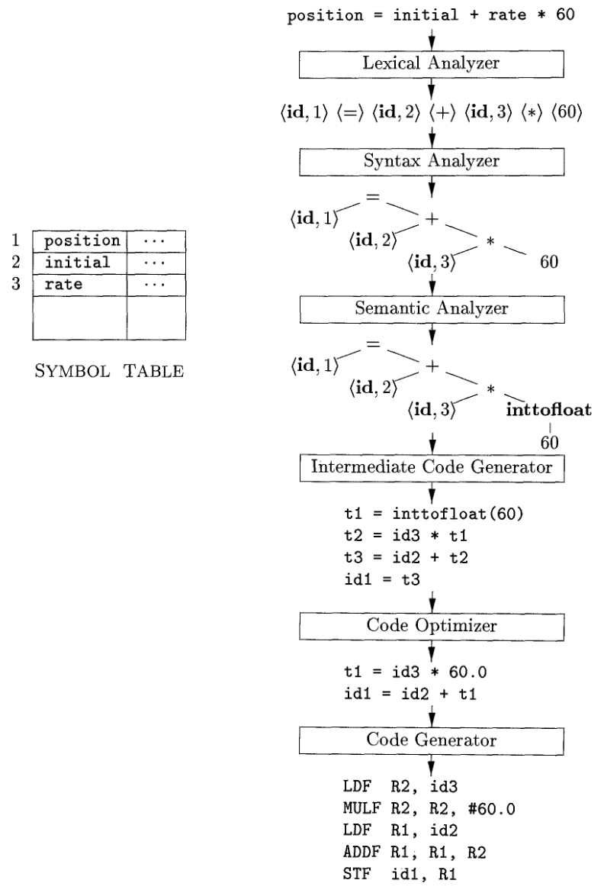

---
geometry:
- lmargin=0.9in
- rmargin=0.3in
- tmargin=0.3in
- bmargin=0.5in
- twoside
papersize: A4
...

# The Structure of a Compiler

- Two parts - **analysis** and **synthesis**
- Analysis part looks into the source program and informs the user of any
  error in syntax or wrong symantics.
    - It also forms the symbol table
    - produces an intermediate representation of source program
- Synthesis part produces target program from intermediate representation using
  the symbol table.

{width=42%}

## Lexical Analysis or Scanning

- Reads the character stream that makes up the source program and groups the
characters into meaningful sequences called lexemes.
- For each lexeme it produces as output a *token* of the form
$$\langle \textit{token-name}, \textit{attribute-value} \rangle$$
- *token-name* is an abstract symbol that is used during syntax analysis,
and the second component *attribute-value* points to an entry in the symbol
table for this token.

        position = initial + rate * 60

- The above source program will be converted into the following tokens
$$\langle \textbf{id},1\rangle\langle=\rangle\langle\textbf{id},2\rangle
\langle+\rangle\langle\textbf{id},3\rangle\langle*\*\rangle\langle60\rangle$$

{width=45%}

## Syntax Analysis or Parsing
- Syntax analyzer produce tree-like structure that depicts the grammatical
  structure
- interior node represent the operation and the children nodes represent the
  arguments of the operation.

## Symantic Analysis
- It uses the syntax tree and the symbol table to check the source program for
  semantic consistency with language definition.
- It also gathers type information and saves it in either the syntax tree or
  symbol table
- It also performs *type checking* and type conversion (*coercions*). Coercion
  is performed when one type of operator is converted to another type in an
  operation
- Like the **inttofloat** operator being performed in the example.

## Intermediate Code Generation
- There are many intermediate representation of the source program the compiler
  may produce. Many compilers after semantic and syntax analysis produce a
  low-level, machine like intermediate representation that can be thought of as
  the program for an abstract machine.
- This intermediate representation must be easy to produce and it should be
  easy to translate into the target machine.
- Most of these intermediate instructions are three operand instructions.

## Code Optimization
- After the Code generation, code optimizers make the code shorter or run
  faster when converted to target code.

## Code Generation
- This step maps the intermediate representation to the target language.
- If the target language is machine code, then registers and memory locations
  are selected for each of the variables.
- Then the intermediate instructions are converted to machine instructions.

## Symbol Tables
- Data structures used to keep track of the variable names used in the source
  program along with their attributes. 
- The attributes includes things like data type, scope (to know where the
  variable is used), etc.
- Even procedure names are stored along with their attributes like return type,
  arguments, etc.
- This data structure used in the compiler must support fast storage and fast
  retrieval of data.

## Grouping of phases into passes
- Activities in several phases may be grouped into a *pass* that reads input
  file and writes output file.
- Eg - front-end phases of lexical analysis, syntax analysis, semantic analysis
  and intermediate code generation might be grouped into one pass.
- Code optimization might be an optional pass and Code generation could be the
  back-end pass.
- Compiler collections are written in this modular fashion where they are
  designed to produce a particular intermediate representation that allows a
  front-end of a particular language to interface with a back end of a target
  machine.
- Multiple languages can then have their front-end work with a single back end
  of a target machine or a single language front end can interface with
  multiple back ends of target machines.

## Compiler-Construction Tools
Tools to help implement the different phases of a compiler.

1. *Parser Generators* - produces syntax analyzers for a given description of a
   language
2. *Scanner Generators* - produces lexical analyzers from a regular-expression
   description of the tokens of a language.
3. *Syntax-directed translation engines* - produces collections of routines for
   walking a parse tree to generate intermediate code.
4. *Code-Generator generators* - produce a code generator from a collection of
   rules for translating each operation of the intermediate language into
   target machine code.
5. *Data-flow analysis engines* - facilitate the gathering of information about
   how data is transmitted from one part of a program to other part. Important
   for code optimization.
6. *Compiler construction toolkits* - provide integrated set of routines for
   constructing various phases of compiler

# Application of compiler technology
Compiler design techniques are not only used to design compilers. In fact
compiler technology influences a lot of other areas in computer science.

## Implementation of high-level programming languages

An example of how compiler design affects programing language design is the
**register** keyword in C. When the language was first introduced in 1970s, it
was considered necessary for the programmer to be able to decide which
variables resided in registers. This control became unnecessary as efficient
register allocation techniques were developed.  In fact, if a programmer  uses
the **register** keyword it may lead to less performance as low level decisions
like register allocation depends on the machine architecture and hardwiring
low-level resource-management decisions is not a good thing. So we'll be better
off if we leave that decision up to the compiler.

## Optimizations for Computer Architectures

Advancement in computer architecture has also influenced compiler technology.
Two main techniques used in high-performance systems are *parallelism* and
*memory-heirarchies*

### Parallelism

- There is instruction-level parallelism and in that the hardware makes
  arrangements to execute multiple instructions in parallel or there might be
  instructions that perform multiple operations at the same time.
- There are also multiprocessors that have become prevalent and programmers
  can write multi-threaded code to take advantage of this. Some compilers also
  automatically make sequential code into parallel code - the computation of
  such a code is then divided among multiple processors.
- Parallelization techniques have been developed to convert sequential code
  into parallel code to take advantage of multiprocessor.

### Memory hierarchies

- levels of storage with different speed and sizes, the closest to the
  processor being the fastest and the smallest.
- The main bottlenecks in performance is not the speed of the processor but the
  speed of the memory subsystems. - While traditionally compilers optimize the
  processor execution, more emphasis is now being placed on making memory
  hierarchy more efficient.
- Managing registers is one of the most important problems in optimization.
- It is also possible to improve the effectiveness of the memory hierarchy by
  changing the layout of the data and rearrange the code thus changing the
  order of data access - this takes advantages of the cache in the processor.

## Design of new computer architectures

In modern computer architecture development, the compilers are developed in
process-design stage and the compiled code is tested on simulators to evaluate
the features of the architecture. In earlier days, the compiler was made after
the architecture was designed. The change is because of the norm shifting
towards the use of high-level programming language and the compiler plays a
huge role in determining the performance of code than just the raw power of the
hardware.

### RISC

Best example of when compiler design influenced computer architecture. RISC
made the instructions simpler and less in number than CISC, laying more
emphasis on compilers to do the job to come up with efficient target code and
making the hardware more maintainable. Even though x86 processor is a popular
architecture and is a CISC architecture, the most efficient way to use it is
just by using simpler instructions.

### Specialized Architecture

Specialized architecture features are proposed and are developed along side
with compiler techniques as well in order to accomplish them. Compilers are
built to use the proposed specific architectural features and then evaluated in
a simulator. Thus, the development of compiler technology also affects the
implementation of specialized hardware.

## Program Translation

The techniques used to convert high level language to low level language can
also be used to convert one language to another.

### Binary Translation

Compiler technology can be used to convert the binary code from machine to
another, allowing a machine to run programs which were compiled for another
instruction set. Many companies used binary translation to make their programs
available on different types of machines. It was also used to provide legacy
support for programs that were written for an older instruction set that was
not being used any more.

### Hardware Synthesis

Hardware can also be expressed using high level languages like Verilog and
VHDL. Hardware designs are described in RTL (register transfer level) where the
variables represent registers and the expression, combinational logic. Hardware
synthesizers convert RTL to gates which are then mapped to transistors and
eventually to physical circuitry.

### Database Query Interpreters

SQL and other query languages are used to interact with a Database server. They
consists of predicate and boolean expressions as well. They allow to search,
modify and add data to a database.

### Compiled Simulation

Simulation are used to evaluate a design or experiment with a phenomenon, but
they can be expensive as the design must be provided to the simluator along
with the parameters ans input. Compiled Simulation can be faster and run
natively. These tools take design in VHDL and Verilog and convert them to
faster compiled simulations.

## Software Productivity Tools

Data flow analysis techniques can be used to catch errors in the program
statically (i.e. before they are run). Many of these data-flow techniques used
to detect errors used in compilers can be used to aid programmers while they
are writing code. So many techniques used in compilers can also be used to aid
software productivity by helping programmers.

### Type Checking

Used to catch inconsistencies in programs where operation is applied to the
wrong type of object, or if the parameters passed to the procedure does not
matches it's signature.

### Bounds Checking

C does not have an array bound check and hence it is up to the user to ensure
the arrays are not accessed out of the bounds. This can compromise security by
leveraging buffer overflow techniques.

### Memory-Management Tools

Garbage collection is another example of tradeoff between efficiency and
productivity of programmer and software reliability. Static tools that check
for memory leaks and other memory errors have also been developed.
