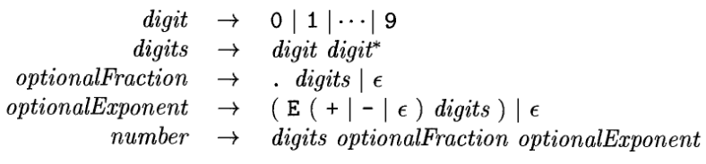
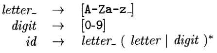
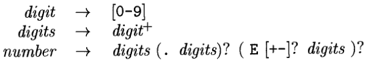
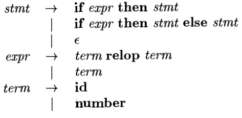
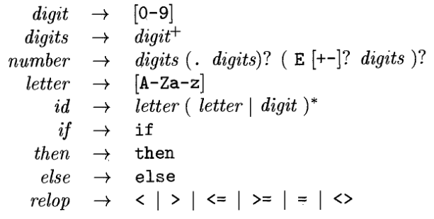
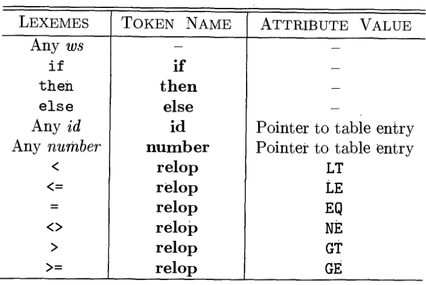
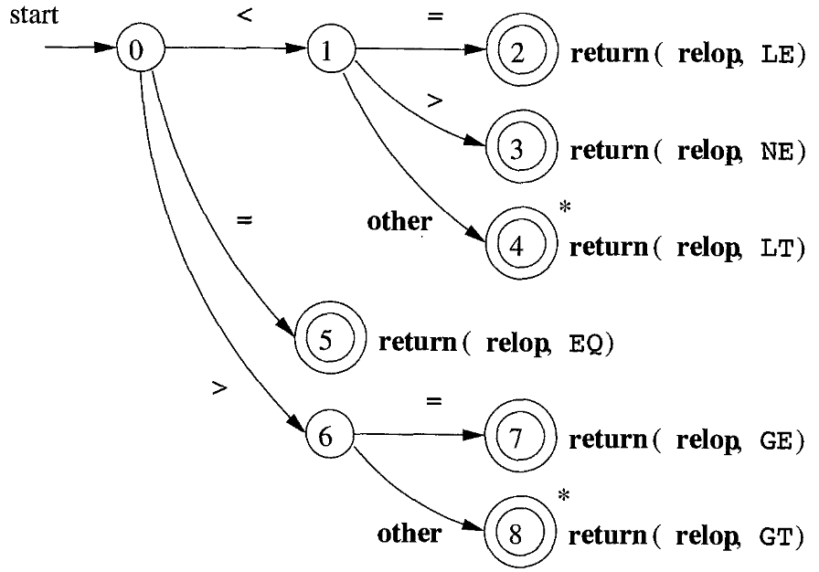
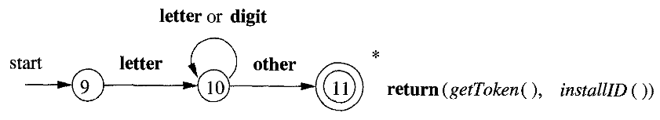
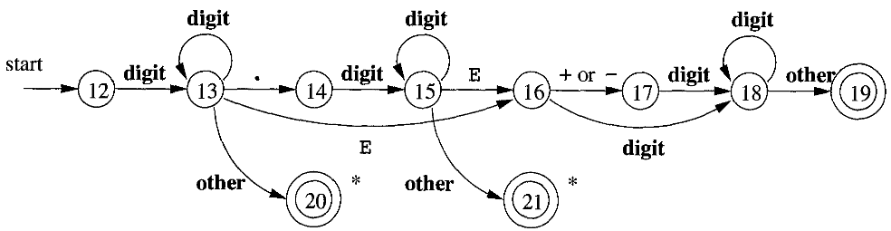
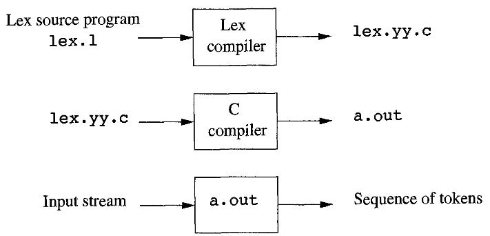

---
geometry:
- lmargin=0.9in
- rmargin=0.3in
- tmargin=0.3in
- bmargin=0.5in
- twoside
papersize: A4
...

\begin{huge}
\textbf{Chapter 3 - Lexical Analysis}
\end{huge}


We usually use *lexical-analyser generators* to which we feed the patterns of
the lexemes and the generator then produces code that works as a lexical
analyser. These patterns are specified using regular expressions. These
expressions are converted into NDFSM and then to DFSM. These two models are
then fed to a "driver" that simulates these automaton and decide the next
token.

# The Role of the Lexical Analyzer

- Main task - read the input characters of the source program, group them into
  lexemes and produces as output a sequence of tokens for each lexeme in the
  source program. The stream of tokens is then sent to the parser for syntax
  analysis
- It also interacts with the symbol table.
- The interactions between the parser and the lexical analyser are depicted in
  the Fig 1 and it's implemented in a way where the parser calls the lexical
  analyser by the *getNextToken* command. The calls causes the lexical analyser
  to read characters from the input and determine the next lexeme and produce
  the next token for the parser.

{width=70%}

- Lexical analyser may also perform some other tasks like stripping out
  whitespaces and comments.
- It may also indicate errors by inserting error message in the appropriate
  lines by keeping track of line numbers and may also perform macro expansion.
- Sometimes they are divided into **two processes**:
  1. **Scanning** consists of simple process that do not require tokenization
  like deleting comments and whitespaces.
  2. **Lexical Analysis** is the main part where the scanner produces output as
  a sequence of tokens.

## Lexical Analysis Versus Parsing.

Reasons why the analysis process of compiler is split into lexical analyser and
parser (syntax analyser):

1. **Simplicity of design**. The separation of tasks helps us simplify at
   leasts one of those tasks. Like the lexical analyser once done with dealing
   with whitespaces and comments, it's easier and simpler for the syntax
   analyser to parse it with the assumption that the comments and the
   whitespaces have been removed rather than having to process them as well.
2. **Compiler efficient is improved.** A separate lexical analyzer helps us to
   apply specialized techniques to improve the efficiency only of the lexical
   task. Like one example is using specialized buffering techniques during
   reading the input to speed up the compiler.
3. **Portability is enhanced**. Input-device-specific peculiarities can be
   restricted to lexical analyzer.

## Tokens, Patterns, and Lexemes

- A **token** is a pair consisting of a token name and a token attribute value.
  The token name is an abstract symbol representing the kind of lexical unit,
  e.g., a keyword, or an identifier.
- A **pattern** is a description of the form the lexemes of a token may take.
  In the case of a keyword as a token, the pattern is just a sequence of
  characters that form that keyword.
- A **lexeme** is a sequence of characters that matches the pattern for a token
  and is identified by the lexical analyzer as an *instance* of that token.

## Attributes for tokens

- Attribute values for tokens are used to provide more information about the
  token. For example a token of number matches both the lexemes `0` and `1`,
  thus to provide more information to the other phases of the compiler,
  attribute values are used.
- The token name influences how the parsing is done, while the attribute value
  influences the translation of the tokens after the parse.
- The attribute value of ta token may consist a great deal of information about
  that token. An attribute value can be a structure of information about that
  token. For example for an **id** token, there can be information about it's
  type, it's lexeme, or it's location in the source code. All this information
  is kept in the symbol table. Hence the attribute value is a pointer to an
  entry in the symbol table.
- **Example**: Token names and associated attribute values:

                                            E = M * C ** 2

  $\langle\textbf{id}, \text{pointer to symbol-table entry for \texttt{E}}\rangle$\
$\langle\textbf{assign\_op}\rangle$\
$\langle\textbf{id}, \text{pointer to symbol-table entry for \texttt{M}}\rangle$\
$\langle\textbf{mult\_op}\rangle$\
$\langle\textbf{id}, \text{pointer to symbol-table entry for \texttt{C}}\rangle$\
$\langle\textbf{exp\_op}\rangle$\
$\langle\textbf{number}, \text{integer value 2}\rangle$\

  For the last the token (**number**) a typical compiler would store a
  character string in the symbol table representing the number. In this case
  "2" and the pointer to it would be the attribute value of the token.

## Lexical Errors
- The lexical analyzer is not always able to identify an error without the help
  of another component. For example `fi ( a == f(x))...`. In this case `fi`
  could be a **id** of a function that is not yet declared or it could be a
  misspelled form of "if". The lexical analyzer pases it as an id and lets the
  parser decide whether it's valid or not
- Lexical errors can be corrected/recovered by the lexical analyzer itself. If
  no patterns match the prefix of the remaining input, then the lexical
  analyzer can delete the successive characters from the input until a token is
  found.
- There are a few more such **transformation** that the lexical analyzer can
  perform to "repair" the input:
  1. Delete one character from remaining input.
  2. Insert a missing character from remaining input.
  3. Replace a character with another character.
  4. Transpose two adjacent characters.
- A simple strategy may be to see if the remaining input can be transformed
  into a valid lexeme with a single transformation.


# Input Buffering

Sometimes it's necessary to lookahead one or more character beyond the next
lexeme before we can be sure we have the right lexeme. For example we cannot be
sure we've seen the end of an identifier until we see a character that is not a
digit or a letter, and therefore is not a part of the identifier. A single
character operator like `<`, `=` or `-` could also be the start of a two-character
operator like `<=`, `==` or `->`.

## Buffer Pairs

- Buffering is used to reduce the amount of overhead required in reading a
  single character. An important scheme involves two buffers that are
  alternatively reloaded.

{width=75%}

- Each buffer is of the size *N* where *N* is usually the size of a disk block.
- We can use one system read command to read *N* characters into the buffer
  rather than using one system call for each character.
- **eof** marks the end of the source program.
- Two pointers are maintained:
  1. `lexemeBegin`, marks the beginning of the current lexeme whose extent is
  being determined.
  2. `forward` scans ahead until a pattern is found.
- When `forward` reaches the end of the buffer, we reload the second buffer and
  then point forward to the start of the second buffer.
- We never overwrite a lexeme in the buffer before determining it.

## Sentinels

- If we use the previous scheme we have to make two tests every time we read a
  character, one for determining the end of buffer and the other to determine
  what character was read.
- We can combine both of these tests using a sentinel character that marks the
  end of the buffer. The sentinel character is a special character that cannot
  be a part of the source program.
- **eof** is the choice here. It still retains it's use as the end of file
  marker, as if it's encountered anywhere else other than the end of the buffer
  it means that we have reached the end of the source program.
- Algorithm:
```
        switch (*forward++) {
            case eof:
                if (forward  is at the end of first buffer) {
                    reload second buffer;
                    forward = beginning of second buffer;
                }
                else if (forward  is at the end of second buffer) {
                    reload first buffer;
                    forward = beginning of first buffer;
                }
                else /* eof within a buffer marks the end of input */
                    terminate lexical analysis;
                break;
            /*Cases for other character*/
            /*   ..    */
            /*   ..    */
        }
```

# Specification of Tokens

## Strings and Languages

## Operations on Languages

## Regular Expressions

- Notation used to describe a language.
- Some conventions:
  1. The unary operator `*` has highest precedence and is left associative.
  2. Concatenations has second highest precedence and is left associative.
  3. `|` has lowest precedence and is left associative.
- Language that can be defined by a regular expression is called a regular set.
  if two regular expression $r$ and $s$ denote the same regular set, we say
  they are equivalent write r=s

{width=70%}#

## Regular Definition

- For convenience, we may give names to the regular expressions and use those
  names in subsequent expressions, as if the names were themselves symbols.
- If $\sum$ is the alphabet of basic symbols, then *regular definition* is a
  sequence of definitions of the form:

  $$d_1 \to r_1$$
  $$d_2 \to r_2$$
  $$d_3 \to r_3$$

  where:
    1. Each $d_i$ is a new symbol, not in $\sum$ and not same as any other
       *d's*
    2. Each $r_i$ is a regular expression over the alphabet $\sum \cup \{d_1,
       d_2,...,d_{i-1}\}$
- _We replace the uses of $d_1$ in $r_2$ by $r_1$, then replacing the use of
  $d_1$ and $d_2$ in $r_3$ by $r_1$ and (the substituted) $r_2$ and so on.

{width=40%}

{width=60%}

## Extensions of Regular Expressions

extensions enhance the ability of regular expressions to be able to specify
string patterns

1. **One or more instances**. Unary postfix operator $^+$ represents the
   positive closure of a regular expression and its language.  Relation between
   Kleene closure and positive closure is: $r^*=r^+ | \epsilon$ and $r^+ = rr^*
   = r^*r\*$
1. **Zero or one instance**. Unary postfix operator $?$ means "zero or one
   occurrence". $r?$ is equivalent to $r|\epsilon$
3. **Character classes**. A regular expression $a_1 | a_2 | ... | a_n$ can be
   replaced by the shorthand $[a_1 a_2 ... a_n]$. When $a_1,a_2 ... a_n$ are a
   logical sequence then they can be replaced by $[a_1 - a_n]$. Like the
   sequence of numbers or alphabets. [a,b,c] is a shorthand for a|b|c, and
   [a-z] is a shorthand for a|b|c|...|z.

**Simplification of the previous two examples**:

{width=35%}

{width=45%}

\pagebreak

# Recognition of Tokens

**Example: Grammar for branching statements**

{width=42%}

Ther terminals - **if, then, else, relop, id** and **number** are the names of
the tokens and their patterns are described using regular definitions below

**Patterns for tokens**

{width=55%}

**Tokens, their patterns and attribute values for the example**

{width=60%}

## Transition Diagrams

We make transition diagrams from the regular expressions. Some conventions
about transition diagrams:

1. Certain states are said to be *accepting,* or *final*. These states indicate
   that a lexeme has been found, although the actual lexeme may not consist of
   all positions between the *lexemeBegin* and *forward* pointers. We always
   indicate an accepting state by a double circle, and if there is an action to
   be taken -- typically returning a token and an attribute value to the parser
   -- we shall attach that action tot he accepting state.
2. In addition, if it is necessary to retract the *forward* pointer one
   position (i.e., the lexeme does not include the symbol that got us to the
   accepting state), then we shall additionally place a $^*\*$ near that
   accepting state. If there are multiple number of retractions required then
   we can attach any number of $^*\*$'s to the accepting state.
3. One state is designated the *start state*, or *initial state*; it is
   indicated by an adge, labeled "start," entering from nowhere. The transitio
   diagram always begins in the start state before any input symobols have been
   read.

{width=56%}

\pagebreak

## Recognition of Reserved Words and Identifiers

There are two methods discussed:

1. We can already have entries in the symbol table for the reserved words and
   then have the same transition diagram for both **id** and reserved word
   tokens as they are the same. And when we get a token accepted we check if
   it's there in the symbol table already - if it is, then we know that it is a
   reserved word. We consult the symbol table basically. If an actual **id**
   token is accepted and we find that it's already in the symbol table then we
   check the token name in the symbol table - which would be **id** from the
   previous time that token was encountered.

{width=72%}

2. We can have a separate transition diagram for every reserved keyword and run
   it. For this every single character of the keyword must be checked one by
   one changing states.

{width=80%}


## Completion of the Running Example

We can then now make a transition diagram for **number** token similarly.

{width=85%}


## Architecture of a Transition-Diagram-Based Lexical Analyzer

Transition Diagrams can be implemented as switch cases: (page 158)
- We can run the transition in parallel or one by one in a sequence or just
  combine all the transition diagrams into one transition diagram


# The Lexical-Analyzer Generator `Lex`

Lex produces a lexical analyzer by giving it an input of regular expressions
describing the patterns for tokens. Lex takes input in *Lex language* that
denotes the patterns of the tokens.  Behind the scenes, Lex converts these
patterns into transition diagrams and produces code in a file called lex.yy.c


{width=55%}

The parser works closely with the lexical analyzer and hence uses the compiled
C code as a subroutine call.

## Use of `Lex`


## Structure of `Lex` Programs

```
         declarations
         %%
         translation rules
         %%
         auxiliary functions
```

- **declaration** section consists of declarations of variables, *manifest
  constants* (identifiers declared to stand for a constant, eg the name of a
  token), and *regular definitions* (like seen before)
- **translation rules** each have the form

```
         pattern { action }
```

- `pattern` is a regular expression that may use the regular definitions from
  the declaration section. The `actions` are fragments of code typically
  written in C.
- The third section holds whatever additional functions required for the
  actions.
- This is how the lexical analyzer works with the parser:
  1. The parser calls the lexical analyzer and the lexical analyzer reads the
  remaining input until it finds the longest prefix in the input matching a
  pattern $P_i$. It then executes the corresponding action $A_i$
  2. If $A_i$ returns something then that is returned the parser else the
  lexical analyzer finds another lexeme that will return a value to the parser.
  A situation where nothing is required to be returned is when the lexical
  analyzer finds a whitespace lexeme.
  3. The lexical analyzer returns the token name to the parser and uses the
  global variable `yylval` to pass additional information like the attribute of
  the token, if needed.
- **Look at the example 3.11 on page 165**


## Conflict Resolution in `Lex`
(related to the above example 3.11)

## The Lookahead Operator
- If we want to match a pattern for a lexeme and it depends on a particular
  pattern that follows that lexeme, then we can use the lookahead operator
  which will match the pattern after `/` and decide to accept the lexeme
