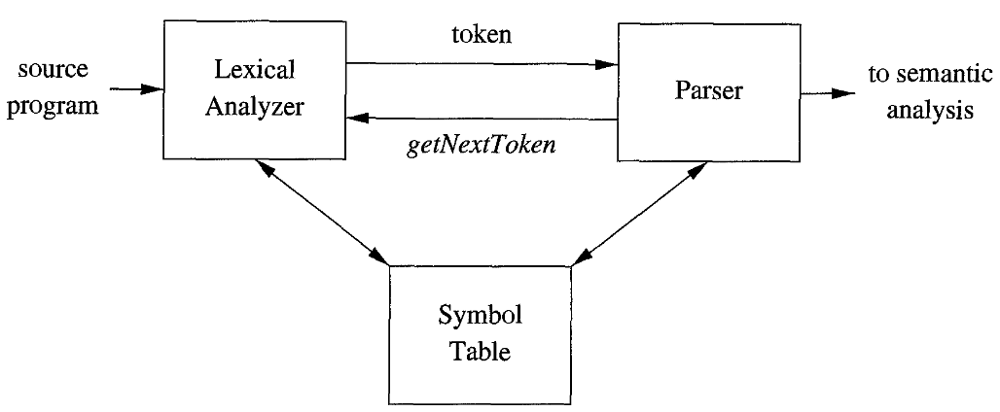
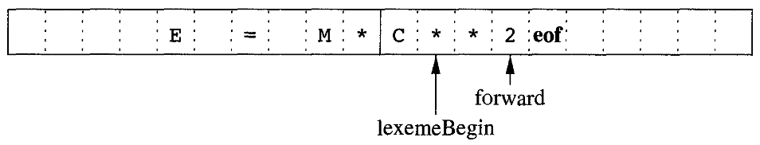
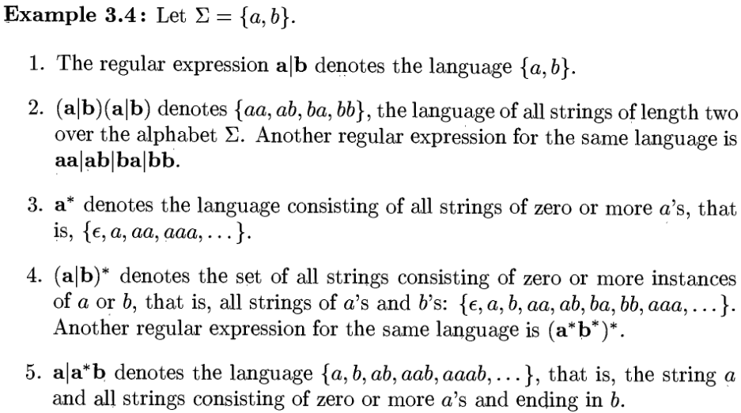
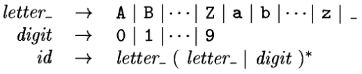

---
geometry:
- lmargin=0.9in
- rmargin=0.3in
- tmargin=0.3in
- bmargin=0.5in
- twoside
papersize: A4
...

\begin{huge}
\textbf{Chapter 3 - Lexical Analysis}
\end{huge}


We usually use *lexical-analyser generators* to which we feed the patterns of
the lexemes and the generator then produces code that works as a lexical
analyser. These patterns are specified using regular expressions. These
expressions are converted into NDFSM and then to DFSM. These two models are
then fed to a "driver" that simulates these automaton and decide the next
token.

# The Role of the Lexical Analyzer

- Main task - read the input characters of the source program, group them into
  lexemes and produces as output a sequence of tokens for each lexeme in the
  source program. The stream of tokens is then sent to the parser for syntax
  analysis
- It also interacts with the symbol table.
- The interactions between the parser and the lexical analyser are depicted in
  the Fig 1 and it's implemented in a way where the parser calls the lexical
  analyser by the *getNextToken* command. The calls causes the lexical analyser
  to read characters from the input and determine the next lexeme and produce
  the next token for the parser.

{width=70%}

- Lexical analyser may also perform some other tasks like stripping out
  whitespaces and comments.
- It may also indicate errors by inserting error message in the appropriate
  lines by keeping track of line numbers and may also perform macro expansion.
- Sometimes they are divided into **two processes**:
  1. **Scanning** consists of simple process that do not require tokenization
  like deleting comments and whitespaces.
  2. **Lexical Analysis** is the main part where the scanner produces output as
  a sequence of tokens.

## Lexical Analysis Versus Parsing.

Reasons why the analysis process of compiler is split into lexical analyser and
parser (syntax analyser):

1. **Simplicity of design**. The separation of tasks helps us simplify at
   leasts one of those tasks. Like the lexical analyser once done with dealing
   with whitespaces and comments, it's easier and simpler for the syntax
   analyser to parse it with the assumption that the comments and the
   whitespaces have been removed rather than having to process them as well.
2. **Compiler efficient is improved.** A separate lexical analyzer helps us to
   apply specialized techniques to improve the efficiency only of the lexical
   task. Like one example is using specialized buffering techniques during
   reading the input to speed up the compiler.
3. **Portability is enhanced**. Input-device-specific peculiarities can be
   restricted to lexical analyzer.

## Tokens, Patterns, and Lexemes

- A **token** is a pair consisting of a token name and a token attribute value.
  The token name is an abstract symbol representing the kind of lexical unit,
  e.g., a keyword, or an identifier.
- A **pattern** is a description of the form the lexemes of a token may take.
  In the case of a keyword as a token, the pattern is just a sequence of
  characters that form that keyword.
- A **lexeme** is a sequence of characters that matches the pattern for a token
  and is identified by the lexical analyzer as an *instance* of that token.

## Attributes for tokens

- Attribute values for tokens are used to provide more information about the
  token. For example a token of number matches both the lexemes `0` and `1`,
  thus to provide more information to the other phases of the compiler,
  attribute values are used.
- The token name influences how the parsing is done, while the attribute value
  influences the translation of the tokens after the parse.
- The attribute value of ta token may consist a great deal of information about
  that token. An attribute value can be a structure of information about that
  token. For example for an **id** token, there can be information about it's
  type, it's lexeme, or it's location in the source code. All this information
  is kept in the symbol table. Hence the attribute value is a pointer to an
  entry in the symbol table.
- **Example**: Token names and associated attribute values:

                                            E = M * C ** 2

  $\langle\textbf{id}, \text{pointer to symbol-table entry for \texttt{E}}\rangle$\
$\langle\textbf{assign\_op}\rangle$\
$\langle\textbf{id}, \text{pointer to symbol-table entry for \texttt{M}}\rangle$\
$\langle\textbf{mult\_op}\rangle$\
$\langle\textbf{id}, \text{pointer to symbol-table entry for \texttt{C}}\rangle$\
$\langle\textbf{exp\_op}\rangle$\
$\langle\textbf{number}, \text{integer value 2}\rangle$\

  For the last the token (**number**) a typical compiler would store a
  character string in the symbol table representing the number. In this case
  "2" and the pointer to it would be the attribute value of the token.

## Lexical Errors
- The lexical analyzer is not always able to identify an error without the help
  of another component. For example `fi ( a == f(x))...`. In this case `fi`
  could be a **id** of a function that is not yet declared or it could be a
  misspelled form of "if". The lexical analyzer pases it as an id and lets the
  parser decide whether it's valid or not
- Lexical errors can be corrected/recovered by the lexical analyzer itself. If
  no patterns match the prefix of the remaining input, then the lexical
  analyzer can delete the successive characters from the input until a token is
  found.
- There are a few more such **transformation** that the lexical analyzer can
  perform to "repair" the input:
  1. Delete one character from remaining input.
  2. Insert a missing character from remaining input.
  3. Replace a character with another character.
  4. Transpose two adjacent characters.
- A simple strategy may be to see if the remaining input can be transformed
  into a valid lexeme with a single transformation.


# Input Buffering

Sometimes it's necessary to lookahead one or more character beyond the next
lexeme before we can be sure we have the right lexeme. For example we cannot be
sure we've seen the end of an identifier until we see a character that is not a
digit or a letter, and therefore is not a part of the identifier. A single
character operator like `<`, `=` or `-` could also be the start of a two-character
operator like `<=`, `==` or `->`.

## Buffer Pairs

- Buffering is used to reduce the amount of overhead required in reading a
  single character. An important scheme involves two buffers that are
  alternatively reloaded.

{width=75%}

- Each buffer is of the size *N* where *N* is usually the size of a disk block.
- We can use one system read command to read *N* characters into the buffer
  rather than using one system call for each character.
- **eof** marks the end of the source program.
- Two pointers are maintained:
  1. `lexemeBegin`, marks the beginning of the current lexeme whose extent is
  being determined.
  2. `forward` scans ahead until a pattern is found.
- When `forward` reaches the end of the buffer, we reload the second buffer and
  then point forward to the start of the second buffer.
- We never overwrite a lexeme in the buffer before determining it.

## Sentinels

- If we use the previous scheme we have to make two tests every time we read a
  character, one for determining the end of buffer and the other to determine
  what character was read.
- We can combine both of these tests using a sentinel character that marks the
  end of the buffer. The sentinel character is a special character that cannot
  be a part of the source program.
- **eof** is the choice here. It still retains it's use as the end of file
  marker, as if it's encountered anywhere else other than the end of the buffer
  it means that we have reached the end of the source program.
- Algorithm:
```
        switch (*forward++) {
            case eof:
                if (forward  is at the end of first buffer) {
                    reload second buffer;
                    forward = beginning of second buffer;
                }
                else if (forward  is at the end of second buffer) {
                    reload first buffer;
                    forward = beginning of first buffer;
                }
                else /* eof within a buffer marks the end of input */
                    terminate lexical analysis;
                break;
            /*Cases for other character*/
            /*   ..    */
            /*   ..    */
        }
```

# Specification of Tokens

## Strings and Languages

## Operations on Languages

## Regular Expressions

- Notation used to describe a language.
- Some conventions:
  1. The unary operator `*` has highest precedence and is left associative.
  2. Concatenations has second highest precedence and is left associative.
  3. `|` has lowest precedence and is left associative.
- Language that can be defined by a regular expression is called a regular set.
  if two regular expression $r$ and $s$ denote the same regular set, we say
  they are equivalent write r=s

{width=70%}#

## Regular Definition

- For convenience, we may give names to the regular expressions and use those
  names in subsequent expressions, as if the names were themselves symbols.
- If $\sum$ is the alphabet of basic symbols, then *regular definition* is a
  sequence of definitions of the form:

  $$d_1 \to r_1$$
  $$d_2 \to r_2$$
  $$d_3 \to r_3$$

  where:
    1. Each $d_i$ is a new symbol, not in $\sum$ and not same as any other
       *d's*
    2. Each $r_i$ is a regular expression over the alphabet $\sum \cup \{d_1,
       d_2,...,d_{i-1}\}$
- _We replace the uses of $d_1$ in $r_2$ by $r_1$, then replacing the use of
  $d_1$ and $d_2$ in $r_3$ by $r_1$ and (the substituted) $r_2$ and so on.

{width=40%}

