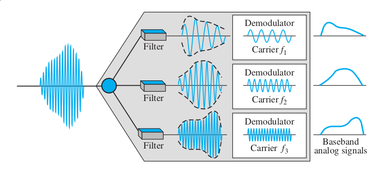

# Multiplexing

- Set of techniques that allow the simultaneous transmission of multiple 
signals across a single data link.
- several low-bandwidth signals are multiplexed and sent across using a
high-bandwidth *link*

{ width=45% }\

The word **link** refers to the physical path. **channel** refers to the
portion of the link that carries the transmission between the giver pair
of lines.

## Frequency Division Multiplexing

- This technique can be used when the bandwidth of the link (in Hz) is greater
than the combined bandwidths of the signals to be transmitted.
In other words -- the link's bandwidth can accommodate all the input lines

- The carrier frequencies(input lines) are separated with sufficient
bandwidth to accommodate the modulated signal. These bandwidth ranges are
called channels

- Channels are separated with strips of unused bandwidth -- **guard bands** --
to prevent overlapping.

- **Implementation**\
For radios and wireless broadcasting, multiplexing is achieved if all the
parties decide to use different carrier frequencies\
In other cases such as cellular networks, a base station assigns the carrier
frequencies

{ width=45% }\

### Multiplexing Process
- Each source if of the similar frequency ranges, therefore they are modulated
to higher frequencies (carrier frequencies - $f_1, f_2\ and\ f_3$)

{ height=18%}

### Demultiplexing Process
- Demultiplexer uses a series of filters to separate the multiplexed signal
into it's component signals
- They are passed through demodulators that result in the original signals

{ height=18% }

### The Analog Carrier System
- Telephone companies multiplex lower bandwidth lines to higher bandwidth lines
to form hierarchical as it is efficient to do so

{ height=20% }

## Wavelength-Division Multiplexing
- Technique to combine optical signals
- Conceptually the same as FDM, except that the signals involved are optical
signals transmitted through fiber-optic channels.
- Prism is used to split and combine light sources

## Time-Division Multiplexing
- A **digital** multiplexing process where several low-rate channels are
combined into one high-rate one
- Instead of portion of bandwidth, time shared. Each connection(input lines)
occupy some time in the link.
- Digital data from different sources are combined into one timeshared link.

### Synchronous TDM
- Each input connection has an allotment in the output even if it's not sending
any data
- **Time Slots and Frames**
  * input is divided into units(char, bit, byte, etc.) and occupies input time
  slot
  * every input unit becomes one output unit and occupies one output time slot,
  but the duration output time slot is *n* times shorter than the duration of
  the input slot
  * if input time slot is $T$ s then output time slot is $T/n$ s
  * *n* is the number of connections
  * rate of the output link must be *n* times faster than input link
  * A *frame* consists of one complete cycle of the input slots
  * with *n* input lines there are *n* slots in each *frame*
- **Example 6.6**\
{ width=55% }
  1. The input duration is the inverse of the bit rate: $1/1$ Mbps = 1$\mu$s
  2. The output bit duration is $1/4$ $\mu$s
  3. The output bit rate is inverse of the output bit duration or $1/4$ $\mu$ 
  s or 4 Mbps.
  4. The frame rate is always the same as any input rate: 1,000,000 frames
  per second.
  5. Also, the duration of the frame is the same as one input unit.

- **Interleaving**
  * It can be visualized as two fas-rotating switches on both sides
  * As a switch opens on the muxing side, the connection as an opportunity to
  send its unit
  * On the de-muxing side, the connection has the opportunity to receive a
  unit

  { width=60% }

- **Empty Slots**\
  Not as efficient. If a connection does not have data to send, then the
  slots are sent empty.

- **Data Rate Management**
  * Multilevel Multiplexing\
{ width=45% }
  * Multiple-Slot Allocation\
{ width=55% }
  * Pulse Stuffing\
  When the connection is not a multiple of others\
  The highest data rate is made dominant and dummy bits are added to the input
  lines with low rates.
{ width=45% }

- **Frame Synchronizing**
  * Some bits are added to each frame so that the demultiplexer can synchronize
with the incoming stream.
  * 1 bit per frame, altering between 0 and 1\
{ width=50% }

- **Digital Signal Service (DS)**
  * Telephone implement TDM in hierarchical manner
  * Just like Analog hierarchy, many channels are multiplexed
  * Every level multiplexes and also adds an overhead (for synchronization
  bits)\
  { width=70% }\
  **DS-0** is a single channel of 64kbps\
  **DS-1** capacity of 1.544Mbps -- $24 \times 64$kbps $+\ 8$kbps(overhead)\
  **DS-2** capacity of 6.312Mbps -- $96 \times 64$kbps $+\ 168$kbps
  (overhead)\
  **DS-3** capacity of 44.376Mbps -- $672 \times 64$kbps $+\ 1.368$Mbps
  (overhead)\
  **DS-4** capacity of 274.1766Mbps -- $4032 \times 64$kbps $+\ 16.128$Mbps
  (overhead)\
  * Each of these services can be used as a single service or can be used
  to multiplex other services

- **T-Lines**
  * To implement to the services phone companies use T-lines with the capacity
  matching the data rates of DS1-DS4 services. There are commercially
  available.

  Service   Line    Rate(Mbps)   Voice Channels
  -------   ----- ------------- ---------------
  DS-1      T-1      1.544                   24
  DS-2      T-2      6.312                   96
  DS-3      T-3      44.736                 672
  DS-4      T-4      274.176               4032

&nbsp;

- **T Lines for Analog Transmission**
  * 24 voice channels can be transmitted through one T-1 Line
  * These are called voice channels as they have a capacity that can carry
  24 voice channels in digital form assuming 4kHz analog voice signals are
  PCM'd with 8000 samples/s using 8bit per sample. 1 digital voice channel then
  becomes 64kbps\
  { width=70% }\

- **T-1 Frame**
  * 1 T-1 Frame = 193 bits ( 24 slots of 8 bit each + 1 sync bit )
  * each slot is a signal sample from each channel\
  { width=70% }\

### Statistical TDM
\- Here the slot are dynamically allocated as they arrive\
\- Only if an input line has a slot's worth of data to send, it is given  a
slot in the output frame\
\- Improves efficiency as no bandwidth is wasted\
\- The multiplexer checks the inputs in a **round-robin** fashion\
\- Synchronization bit is **not** required here\
\- The capacity of the link (output) is normally < the sum of the
capacities of each input channel.

- **Addressing**
  * In Synchronous TDM there is no fixed predefined relationship between the inputs and
  the outputs and there is not reservation of slots.
  * In TDM, there was no need of addressing as the synchronization itself
  served as an addressing mechanism
  * Here however, we need addressing to ensure each slot reaches it's 
  output connection.
  * Simplest form of addressing -- *n* bit addressing for *N* lines where 
  $n=\log_2 N$
  * Eight lines = 3 bit address.\
  { width=65% }\

- **Slot Size**
  * ratio of data size to address size must be reasonable to make transmission
  efficient. 1 bit per slot with 3 bit addressing is $300\%$ overhead
  * The block data is usually many bytes and the address is just a few bytes.

# Spread Spectrum

\- We combine signals from different sources but for reasons different than
bandwidth efficiency\
\- **Used in wireless communications** where other concerns outweigh bandwidth efficiency -- Such as eavesdroppers and signal jammers. Stations must be able
share the air medium without these problems.\
\- If required bandwidth for a station is *B*, spread spectrum expands it to
$B_{SS}$, such that $B_{SS} >> B$.\
\- This expanded bandwidth acts as an envelope to secure the station's
message.\
\- 2 principles are followed:

  1. The allocated bandwidth to each station must be, by far, larger than what
  is needed. This allows redundancy.
  2. The spreading process must take place independent of the original signal,
  ie. the spreading process occurs after the signal is created from the
  source.\
  { width=50% }\
  The spreading code looks like a series of random numbers but they have a 
  pattern

## Frequency Hopping Spread Spectrum (FHSS)
\- This technique uses *M* different carrier frequencies that are modulated by
the source signal.\
\- At one moment, the signal modulates one carrier frequency; at the next
moment, it modules another carrier frequency.\

(Refer Figures)

- A *pseudorandom noise (PN)*, creates k-bit pattern for every *hopping
period* $T_h$
- The pattern maps to a frequency on the *frequency table* to be used for this
hopping period and passes it on to the *frequency synthesizer*
- If $M=8$ then $k=3$ and 8 different 3-bit patterns are created. These
patterns are repeated after every 8 hops in the same order (Note: This
example is non-practical; *M* is much larger in real)
- If *M* is large and $T_h$ is short, the sender and receiver can have privacy.
It also has an anti-jamming effect.

{ width=55% }
{ width=45% }

&nbsp;

**Bandwidth Sharing**\
\- We can multiplex the *M* frequencies together into the same $B_{SS}$
bandwidth. This is possible as a station uses only one frequency in each hopping period\
\- FHSS Similar to FDM -- In FDM each station uses *1/M* of the bandwidth, but
allocation is fixed; FHSS, each station uses *1/M* but of the bandwidth, but
the allocation changes hop to hop.\
{ width=55% }

|                                                                                                               << fig 6.32 >>

## Direct Sequencing Spread Spectrum
\- We replace each bit with *n* bits called the chips. The chip rate is *n*
times that of the data bit.\
\- Original data is multiplied by the chips to get the *spread signal*\
\- Eg: Barker Sequence -- $n=11$; If data rate = *N* then spread signal is
$11 \times N$ and even bandwidth required is 11 times larger than the original
signal\
\- If the spread signal cannot be combined and separated then bandwidth
sharing is not possible. A special code is required to achieve bandwidth
sharing\
{ width=75% }
