# Switching
- Using hardwired point-to-point mesh topology and star topology is inefficient for large networks
and hence we use switching
- Switched network consists of nodes, called switches. Switches are devices
capable of creating a temporary connection between two or more devices that
are linked to it.\
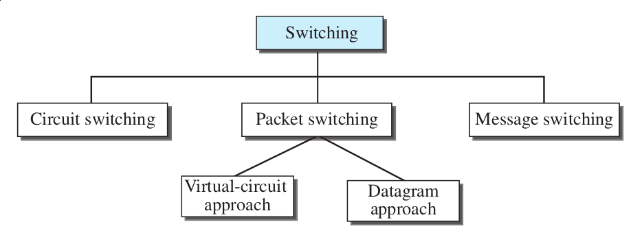{width=60%}

- *Switching and TCP/IP Layers :*
  * Switching at Physical Layer -- Only circuit switching. Switches physically
  allow signals to travel in one path or the other
  * Switching at Data-Link Layer -- Packet Switching. (virtual-circuit)
  Packet refers to frames or cells. 
  * Switching at Network Layer -- Packet Switching. (virtual-circuit or Datagram)
  * Switching at Application Layer -- Message switching (No solid example)

## Circuit-Switched Networks
- Consists of switches connected by physical links. Every connection
uses one dedicated channel on each link
- Connection between two stations is a dedicated path made of one or more
links.\
  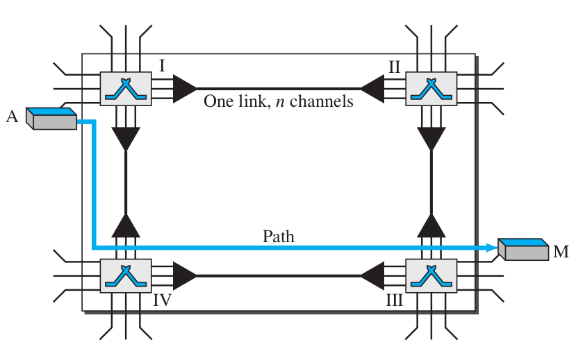{width=70%}
    * A sends a request to M, that must be accepted by all switches and also
    M (Setup Phase)
    * A circuit (channels) is reserved in each link, and the combination of
    the channels and links make the dedicated path
    * Data is transferred (data transfer phase) and then the circuits are torn
    down
- Before communication the stations **must make reservation of the resources**
(channels bandwidth in FDM and time slots in TDM), switch buffers switch ports, processing
time, and **must remain dedicated during the entire duration of data transfer**.
- The data are a continuous flow sent by the source station and received by the
destination station. There may be period of silence.
- There is not addressing involved, It's all physical. Though during setup
phase addressing is used.
- Before *A* and *M* can start talking, a dedicated circuit needs to be setup
 that is a combination of channels and links. 
- *A* first sends a setup request which includes the address of *M* to Switch I.
- Switch I finds a channel between itself and Switch IV, which then finds
a channel between itself and Switch III. M then sends an acknowledgment in
opposite direction to system A.
- The addresses are assigned by the network admin.
- **Efficiency**
  * The resources are only available to one connection at any given time
  * **Delay** is minimal. During data transfer, data in not delayed at a given
switch\
  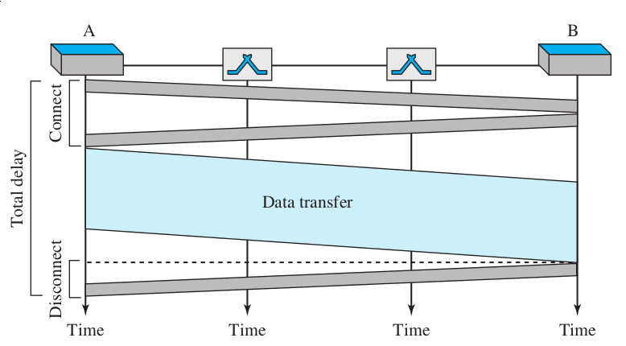{width=70%}

## Packet Switching
\- Message is divided into packets; size decided by the network and protocol\
- There is **no resources allocation** for a packet, no reserved bandwidth
or processing time for each packet.\
- **Resources allocated on demand** and on first-come, first-served basis.\
- There is a waiting time for each packet if there are other packets being
processed

### Datagram Networks
- Each packet is treated equally and independently of others, even if it
belongs to the same transmission.
- Switches are traditionally referred to as *routers*\
  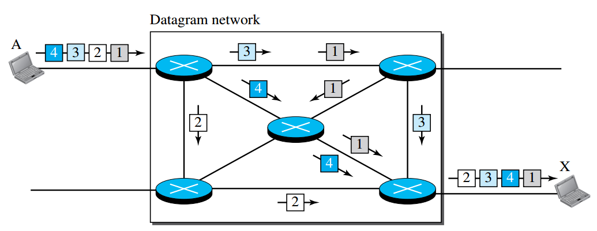{width=85%}
  * Four datagrams belong to the same message, but may travel different paths
  to reach destination because links might be busy carrying packets from
  other sources and bandwidth is not available.
  * So packets arriving in wrong order is possible. It's the responsibility
  of the upper layer protocol to reorder the datagrams and ask for lost ones.
- They are also referred to as *connectionless networks* as the switch does
  not keep any information of the connection state of the packet (As there is
  no setup processes) 
- **Routing Table** -- A routing table is present in each switch which is
  based on the destination address. The table gives the information to the
  switch where to send it's packet depending on the destination address.
- **Destination Address** -- Every packet has a head containing the
  destination address of the packet. The destination address remains the same
  through out the journey of the packet.
- **Efficiency** -- Better than circuit-switched; resources allocated only
  when packets are to be sent.
- **Delay** -- Packets might have to wait as the switch might be busy
  processing other packets. Delay may be greater than virtual-circuit network.
  Also the delay is not uniform due to which packet of the same message may
  arrive at different times.
  
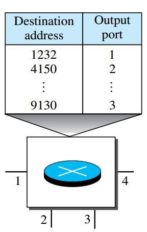{height=20%}

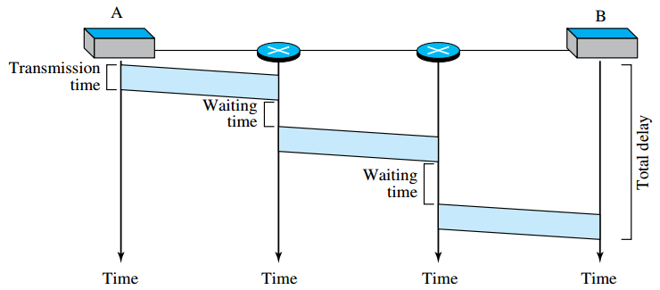{height=22%}

### Virtual-Circuit Networks
Unlike physical circuit switched networks, virtual circuits are setup using
table entries. During the setup phase these "circuits" are setup and an
entry in each router is created for that connection.

1. Cross between circuit-switched and datagram network
1. Setup and teardown process present
1. Resource can be allocated during setup phase, or on demand
1. Packets carry headers, but the address has local jurisdiction
1. All packets follow the same path established during the connection

- **Addressing**
  * *Global Address* -- An address that is unique to each device in the whole
  network. Used to make the table entries for each connection during the setup phase.
  * *Virtual-Circuit Identifier* -- Has a switch scope; VCI changes after it
  passes through each switch.\
  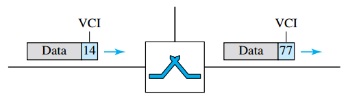{width=55%}

- **Data Transfer Phase** (refer fig. 3)
  * The data arrives in packets and each packet have a VCI number.
  * The VCI number helps each router to send the packet to the next router
  * Each router changes the VCI number in the packet as it arrives, and sends
  it through the assigned output *port*

&nbsp;

&nbsp;

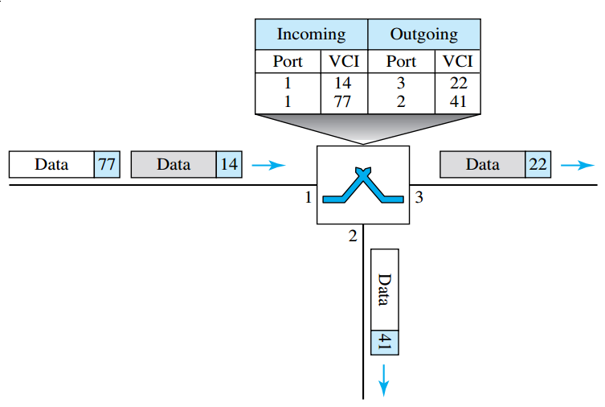{width=70%}

- **Setup Phase**
  * This is when the entries in the tables are made for a virtual-circuit for
  a connection.
  * There are two steps in this process -- *Setup Request* and
  *Acknowledgement*
- *Setup Request*

  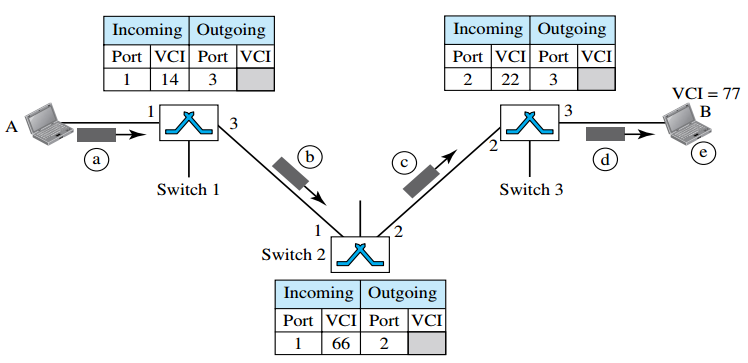{width=76%}
  1. Source *A* sends the setup frame to switch 1
  2. Switch 1 knows that a frame from A to B goes through port 3. The switch
  creates an entry in it's table but only fills 3 columns. Assigns the
  incoming port, VCI and outgoing port.
  3. The setup request frame goes to the switch 2 and 3 and the same thing
  happens
  4. Finally frame reaches the destination and if it is ready receive frames
  from A, it assigns a VCI to the frames coming from A. This way it knows
  that a frame with VCI 77 (in the eg) comes from A.
- *Acknowledgement*
  1. Destination sends the acknowledgement frame to switch 3. This frame
  also carries the global source so that the switches know which entry in the table
  has to be completed.
  2. Switch 3 assigns the VCI 77 as the outgoing VCI in the entry and sends
  the frame off to switch 2 according to the port number in the VCI in its
  table entry and changes the VCI to 22 in the header
  3. The frame is then sent to Switch 2 and the same thing happens.
  4. The frame finally gets transferred to the source with the VCI that was
  chosen by switch 1 in the setup request step.
  5. This VCI is then used by A to send data to B 

  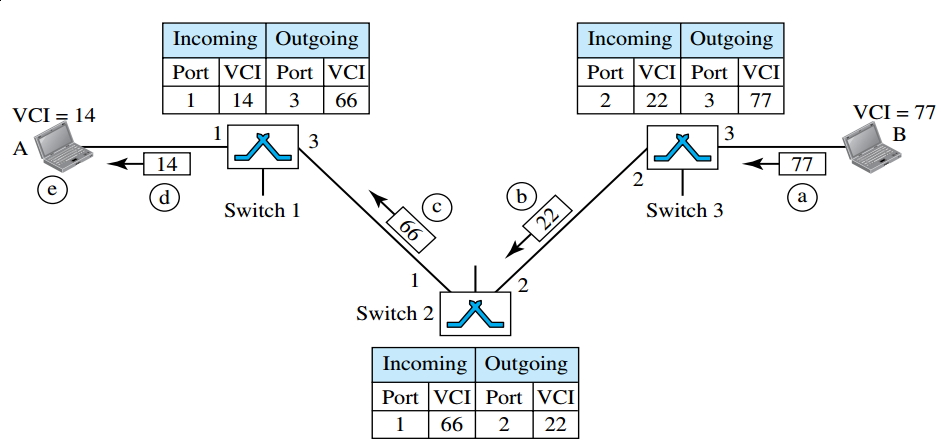{width=80%}

- **Teardown Phase**
  * After A is done sending it's data to B, it sends a special frame called the
  *teardown request*. When B responds to the teardown request frame, all
  switches delete the entry for that connection/virtual-circuit from their
  tables.
- **Efficiency**
  * Resources can be allocated during the setup process or can be on demand
  during data transfer.
  * In the first case, there is no delay but in the second case, there may be
  some delay

  <!--end of list -->
***In Virtual Circuit Switching, all packets belonging to the same source
  destination travel the same path (as the switching tables are setup), but the packets my arrive at the destination with different delays if the resource allocation is on demand.***

- **Delay**
  * There is one time delay during the setup and the teardown process, there
  also may be extra delay if resource allocation is on demand.

  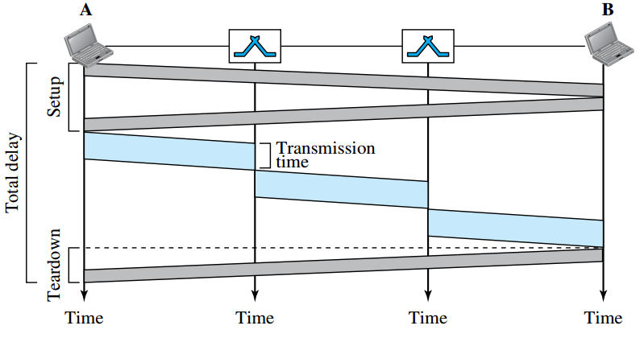{width=70%}

## Additional Notes
- As the name suggests, ***Virtual***-Circuit Network, the circuit that is setup
using the tables in each switch is *Virtual* unlike the physical circuit setup
by the switches in circuit switch network. It's virtual in the sense 
as there are address that define that path of the circuit from one switch to
the other but the circuit doesn't actually exist. Transfer of packets from one
switch to other makes it look like there is a path.
- There are two different tables in the Virtual-Circuit Network Switch. One
is the Switching table, that is setup for each connection and the other is 
the Routing table that is setup according to the Global addresses.
