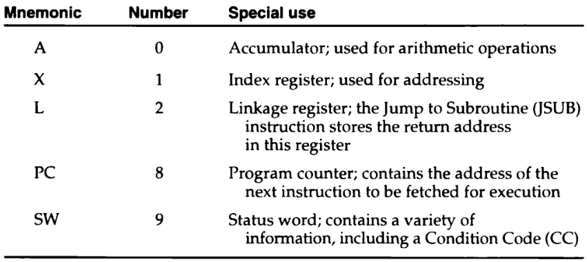
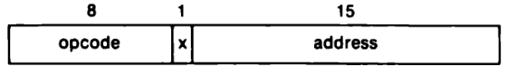
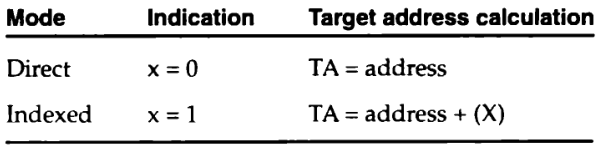
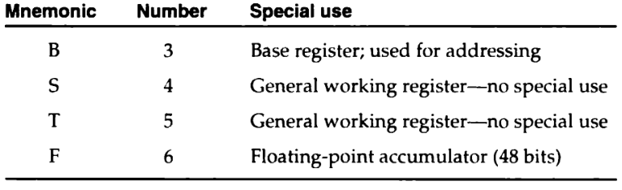
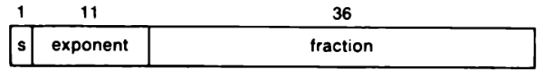
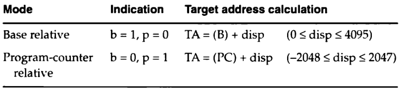
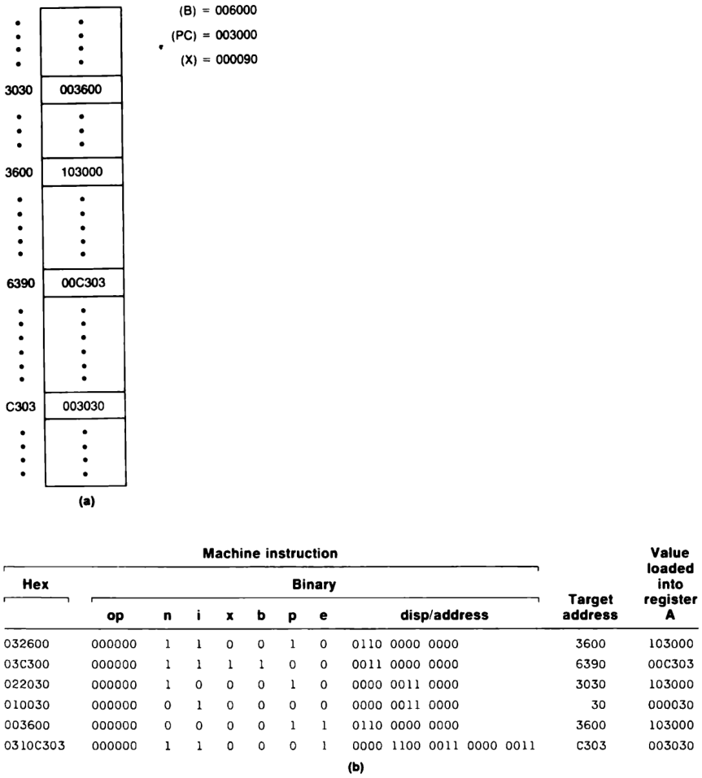

---
geometry:
- lmargin=0.9in
- rmargin=0.3in
- tmargin=0.3in
- bmargin=0.5in
- twoside
papersize: A4
...

## SIC Machine Architechture

### Memory

- 32,768 ($2^{15}$) bytes in memory
- All addresses are byte addresses and words are addresssed by the location
  of their lowest numbered byte.

### Registers

- Each register is 24 bits in length

{width=70%}

### Data Formats

- Integers are stored as 24-bit binary numbers
- There is no floating point in basic SIC

### Instruction Formats

- The flag bit $x$ is used to indicate indexed-addressing mode.

{width=50%}

### Addressing Modes

- two addressing modes available indicated by the $x$ bit
- (X) means the contents of the register X

{width=50%}

### Input and Output

- On the standard version of SIC, input and output are performed by
  trasferring 1 byte at a time to or from the rightmost 8 bits of 
  register A.
- Each device has a 8bit code
- There are three I/O instructions
- Test Device (`TD`) tests whether the addressed device is ready; `CC`
  is set to indicate the result ( < means the device is ready; = means
  it's not ready)
- `RD` and `WD` are used to read and write data to the device. Reading
   will store a byte into register A from the device and writing will
   transfer a byte from register A to the device

## SIC/XE Machine Architecture

### Memory

- Max memory available on SIC/XE system is 1 megabyte ($2^{20}$ bytes).

### Registers

{width=65%}

### Data Formats

- Additional 48 bit floating-point data type

{width=50%}

- The fraction is interpreted as a value between 0 and 1; ie, the binary point
  is assumed to be just before the high-order bit of the fraction.
- For normalized flaoting-point numbers, the high-order bit of the fraction
  must be 1.
- The exponent is an unsigned binary number between 0 and 2047
- If $f$ is the fraction and $e$ is the exponent, then the absolute value of
  the number represeted is: $$f\times 2^{(e-1024)}$$

### Instruction Formats

- SIC/XE provides 4 formats of instructions (Refer Appendix A)

### Addressing Modes

- Format 3 and 4 have flags to specify different addressing modes.
- Two new relative addrssing modes are available for use with *Format 3*

{width=70%}

- In Format 3, for _base relative_ addressing _disp_ field is interpreted as a
  12-bit unsigned integer.  For _program-counter relative_ addressing _disp_
  field is interpreted as a 12-bit **signed** integer, with negative values
  represented in 2's comp.
- In Format 3, If _b_ and _p_ are set to zero then _disp_ is the target
  address. In Format 4, _b_ and _p_ are normally zero and the target address is
  taken from the address field.
- Any of theses modes can be combined with _indexed_ addressing; if bit _x_ is
  set to 1, then (X) is added in target address calculation.
- **Immediate and Indirect addressing** \
  \- In Format 3 and 4, if bit _i_=1 and _n_=0 then the target address is
  itself used as the operand value.(**i**mmediate addressing)\
  \- If bit _i_=0 and _n_=1, the word at the location given by the target address
  is fetched; the _value_ contained in this word is then taken as the _address_
  of the operand value (i**n**direct addressing)\
  \- If _i_ and _n_ are both 0 or 1 then then the target of the address is taken
  as the location of the operand (simple addressing)\
  \- **Indexing cannot be used with immediate or indirect addresssing**\
  \-SIC/XE assemblers will default to 1 for both _i_ and _n_ if the
  instructions do not specify immediate or indirect addressing modes.\
  \-**Standard SIC assemblers will set the _i_ and _n_ bits both to zero
  (this is because all the 8-bit binary codes for SIC instructions end with
  00); if bits _n_ and _i_ are both 0, then the bits _b_, _p_, and _e_ are
  considered to be part of the address field of the instruction. This makes
  Format 3 identical to the format used on the standard version SIC, providing 
  desired compatibility**

