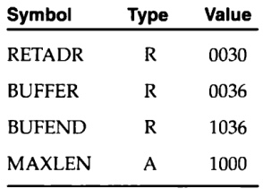
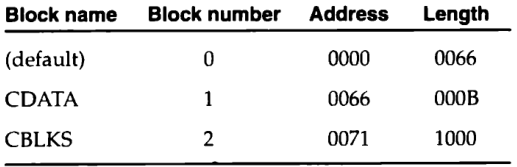

---
geometry:
- lmargin=0.9in
- rmargin=0.3in
- tmargin=0.3in
- bmargin=0.5in
- twoside
papersize: A4
...

# Basic Assembler Functions

## Assembler Algorithm and Data Structures
- Two Data structures - OPTAB (Operation Code Table) and Symbol Table (SYMTAB)
- OPTAB used to look up mnemonic codes and translate them to machine language
- SYMTAB is used to store values (addresses) assigned to labels.
- LOCCTR is the location counter. Initialized to the beginning address
specified by START


# Machine Dependent Assembler features (SIC/XE Assembler)
- Instructions that refer to memory are normally assembled using either base
relative mode or program-counter relative addressing mode.
- BASE directive is used in conjunction with base relative addressing
- If the displacement needed using base relative or program-counter relative is
not possible, then format 4 can be used.

# Look into Section 2.2.1 and the examples

# Program Relocation
- It is desirable to be able to run multiple programs at the same time, sharing
time and memory. For this the program should be relocatable so that it can be
loaded anywhere in the memory where there is space for it.
- Assembler does not know before hand where the program might be loaded, but it
does know the parts that have to be modified during loading.

{width=60%}

- Solution
  1. When Assembler generates object code, JSUB is placed relative to the start
  of the program. That is why location counter is initialized to 0
  2. Assembler will also include the necessary information for the loader,
  instructing it to add the beginning address of the program to the address
  field in JSUB instruction

- A Modification Record is added in the object code to instruct the loader of
the required modifications required during loading
- Modification Record
```
      Col. 1   (1): M
      Col. 2-7 (6): Starting location of the address field to be modified,
                    relative to the beginning of the program (hexadecimal)
      Col. 8-9 (2): Length of the address field to be modified, in half bytes
                    (hexadecimal)
```
- Modification record for JSUB example Fig. 1: `M00000705`
- The parts of the program that need modification are the ones that used direct
  addressing and direct addressing is only possible in format 4
- This is also the advantage of relative addressing - it doesn't require
modification during relocation

# Machine Independent Assembler features

## Literals
- Difference between literal and immediate addressing. With immediate addressing
the operand value is the part of the actual machine instruction but with
literals, the assembler first generates the specified value as a constant at
some memory location and the address of this constant is used as the target
addressed for the machine instruction.
- All of the different literals used in the program are gathered together in a
**literal pool** at the end of the program.
- In some cases it is desirable to store the literals into a pool at some other
location. This can be achieved using **LTORG**. When **LTORG** is encountered,
the assembler creates a literal pool that contains all of the literal operands
used since previous LTORG or the beginning of the program. We use LTORG
directive when it is desirable to have the literals close to the instruction
- Denoted be '=' prefix. eg `=C'EOF'` or `=X'05'`
- Structure needed to handle literals - literal table (LITTAB)


## Symbol-Defining Statements

- Symbols defined till now (before EQU being introduced) where using labels.
The value of a label is the address of the statement where it appears.
- `EQU` directive gives a way to assign values to these labels/symbols
```
        symbol     EQU     value
```
- `EQU` is mainly used to establish symbolic identities so that the source
program is readable.
- `ORG` is used to reset the value of the location counter.
```
        ORG        value
```
- This will reset the value of the location counter to value. (see an example
of how this is used on page 73)
- Restrictions while using `EQU` and `ORG`
  - All symbols used on the right hand side of the statement must
  have been defined previously in the program. This applies both for EQU and 
  ORG. This is a common *forward-reference* problem and cannot be resolved by
  even a two-pass assembler as in a two-pass assembler it is required to define
  all symbols during pass 1.


## Expressions
- Assemblers allow to use expressions wherever we can use a single operand.
- Assemblers allow the use of `+, -, *` and `/`. The terms in the expression can
  be constants, user-defined symbols or special terms (like the current value of
  the location counter - `*`)
- Expressions can be absolute or relative - i.e they can produce absolute values
or relative values (relative values being those that do not need to be touched
during program relocation)
- An absolute expression may contain several relative terms provided that they
occure in pairs in the expression with opposite signs. None of the relative
terms can not enter into a multiplication or division operation.
- In relative expression all of the relative terms except on can be paired.
No relative term may enter multiplication or division operation.
- Expressions need to be flagged so that they can be processed by the
assembler.

{width=20%}

- With this info the assembler can easily determine the type of each expressoin
  used as an operand and generate Modification records in the object program
  for relative values.


## Program Blocks

- Assemblers provide feature to separate the program into segments known
as program blocks. These blocks may appear in different order in the
object program compared to the source program and these blocks may be
handled independently of each other my the assembler.
- The directive `USE` indicates which portions of the source program belong 
to the various blocks.
- `CDATA` - contains data areas that are a few words in length
- `CBLKS` - contains all data areas that consist of larger blocks of memory
- Assembler manages to logically connect the blocks in a way that it seems
they were written continuously. This is accomplished by maintaining a location
counter for each block.
- The blocks are arranged together during Pass 1 and then the address values
that are required for Pass 2 are relative to the start of the program not 
the start of the block.

{width=40%}

- The process of assembling a program with blocks can be imagined as the
  assembler taking the similar blocks (eg default) and stitching them together
  in the same place and then placing the CDATA after default and placing CBLKS
  after CDATA (see fig 2.14)


## Control Sections and Program Linking

- control section is the part of the program that maintains its identity after
assembly; each control section can be loaded and relocated independently of
others. Used for subroutines and other logical subdivisions of the programs.
